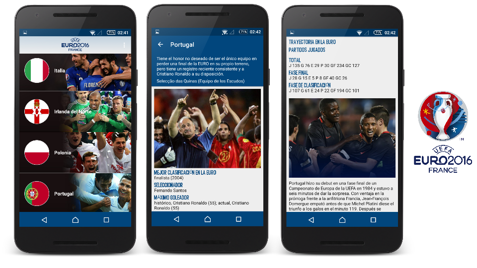

# Clean Architecture on Android. (EUROCUP 2016) 

Example Android Clean Architecture used to explain how to use this architecture (rules) in our android applications.
This example was created to support an article explaining that I have written about how to architect an android application using Uncle Bob's clean architecture. [Aplicando Clean Architecture en Android][1] (Spanish).

Libraries used on the sample project
------------------------------------
* [AppCompat, CardView, RecyclerView and DesignLibrary][2]
* [RxJava & RxAndroid][3]
* [Dagger 2][4]
* [Junit][5]
* [Mockito][6]

# Demo

[1]: https://erikjhordan-rey.github.io/blog/2016/01/27/ANDROID-clean-architecture.html
[2]: http://developer.android.com/intl/es/tools/support-library/index.html
[3]: https://github.com/ReactiveX/RxAndroid
[4]: https://github.com/google/dagger
[5]: http://developer.android.com/intl/es/reference/junit/framework/package-summary.html
[6]: http://mockito.org/

## Inspiring 

I created my own implementation of Clean Architecture and I want to thank you how much I've learned from these magnificent developers.

* [Uncle Bob - The Clean Architecture](https://blog.8thlight.com/uncle-bob/2012/08/13/the-clean-architecture.html)
* [Karumi Team - Rosie is an Android framework to create applications following the principles of Clean Architecture](https://github.com/Karumi/Rosie)
* [Fernando Cejas - Clean Architecture Sample](https://github.com/android10/Android-CleanArchitecture)

Do you want to contribute?
--------------------------

Feel free to report or add any useful feature, I will be glad to improve it with your help.

Developed By
------------

* Erik Jhordan Rey - <erikjhordan.rey@gmail.com>

License
-------

    Copyright 2016 Erik Jhordan Rey

    Licensed under the Apache License, Version 2.0 (the "License");
    you may not use this file except in compliance with the License.
    You may obtain a copy of the License at

       http://www.apache.org/licenses/LICENSE-2.0

    Unless required by applicable law or agreed to in writing, software
    distributed under the License is distributed on an "AS IS" BASIS,
    WITHOUT WARRANTIES OR CONDITIONS OF ANY KIND, either express or implied.
    See the License for the specific language governing permissions and
    limitations under the License.

